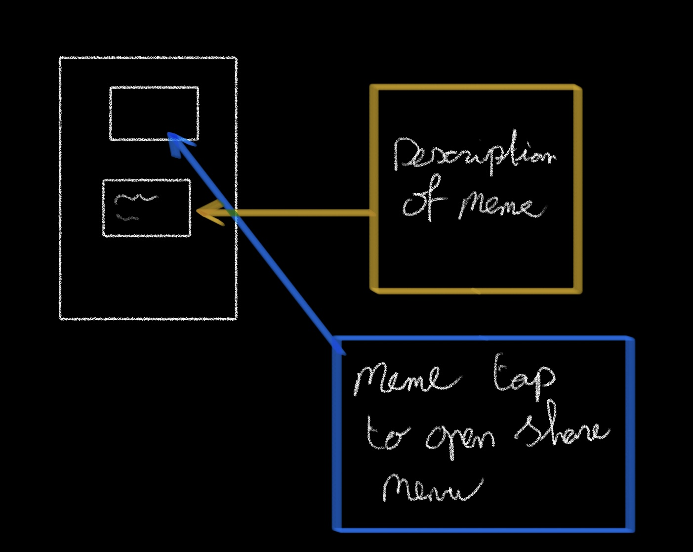
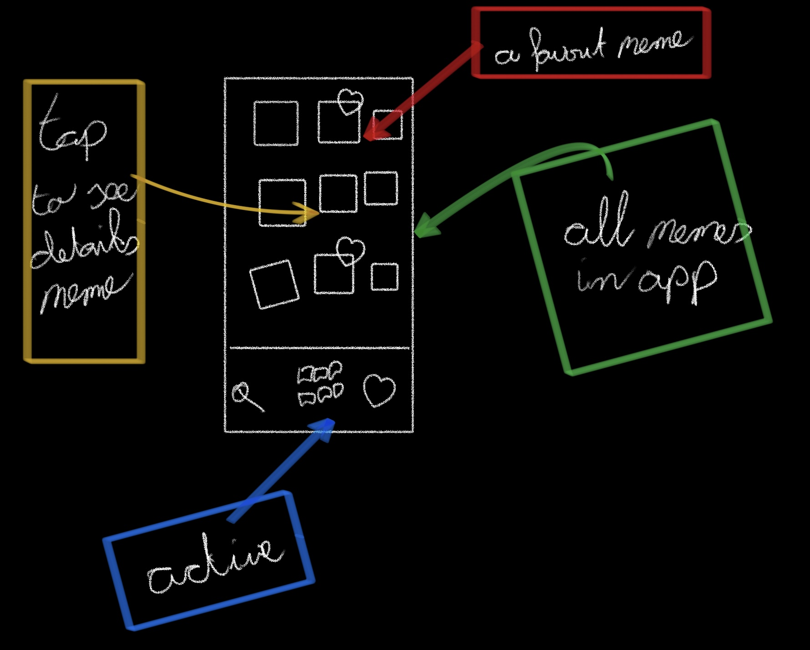
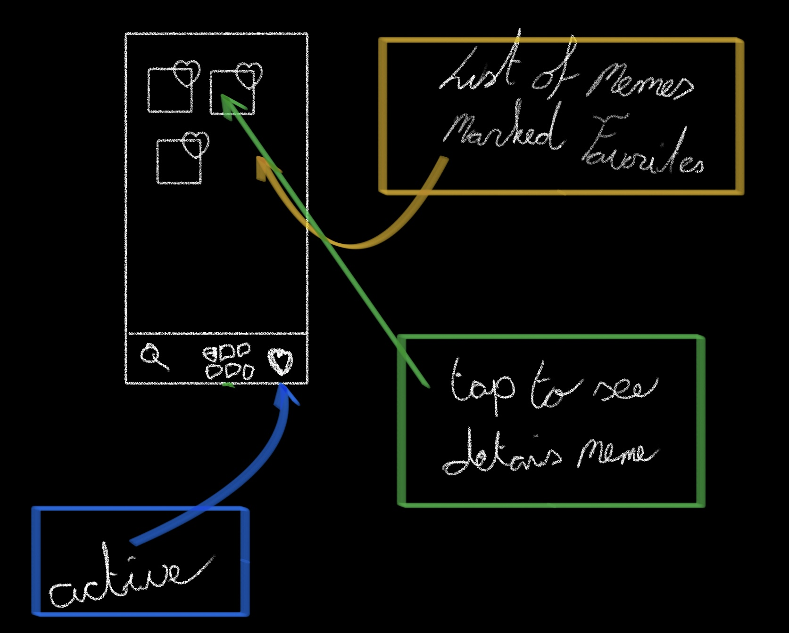
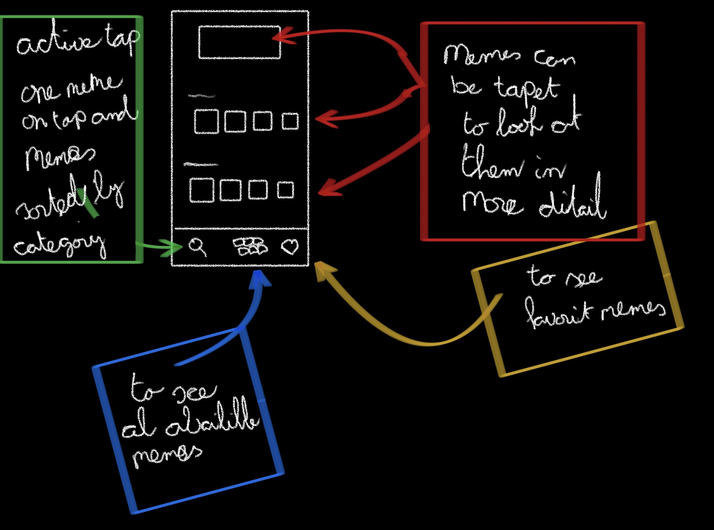

# Humorly

An app that connects people based on their type of humor.

## About Me
    Name                    Marc Vlasblom
    Student Number          14078163
    Subject                 Programmeerproject 
    Track                   iOS
    GitHub Account          https://github.com/marcBook-air
    GitHub Repository       https://github.com/minprog-platforms/project-marcBook-air   
## About the App
    Name                    Humorly
    Target audience         All people who want to expand their social circle
    Minimum age             18
    OS                      iOS
    Programming language    Swift & SwiftUI

## The Problem
This is very personal, but I like to find, save and share memes. But there is one problem though, I need three different apps to do this. Search with Safari, my photos app to save and share via WhatsApp. It would be so much more convenient if there was one app to do all three of these things.
##  The Solution
With Humorly you can seach, save and share memes in one place. You can save memes by liking them, you can search them by looking in the collection or seaching for a particular category and with a dedicated share menu you can share memes with just a tap.
## Scetches

## Prerequisites
### Data Sources
For this project I will use:
- [Swift](https://www.swift.org/documentation/)
- [SwiftUI](https://developer.apple.com/documentation/swiftui/)
### External Components
I need to find or to make a database with memes.
### Similar Apps
The app will be a mix of Instagram and a regular newsapp. The inner workings of Instagram and most newsapps are not public, hence it is not possible to use such information when creating this app.
### Hardest Part
The hardest part for me is to make a clear layout, this is because things can get unclear very quickly if you deal with much of the same type of conent on one page. To solve this problem I will give extra attention to the whole layout. Goal is to make it feel natural while navigating the app.
## Acknowledgements

 - [Used README editor](https://readme.so/nl)
 - [Minor programmeren](https://project.mprog.nl/syllabus)
 - I woudl like to thank Finn for helping me come up with the idea for the app
