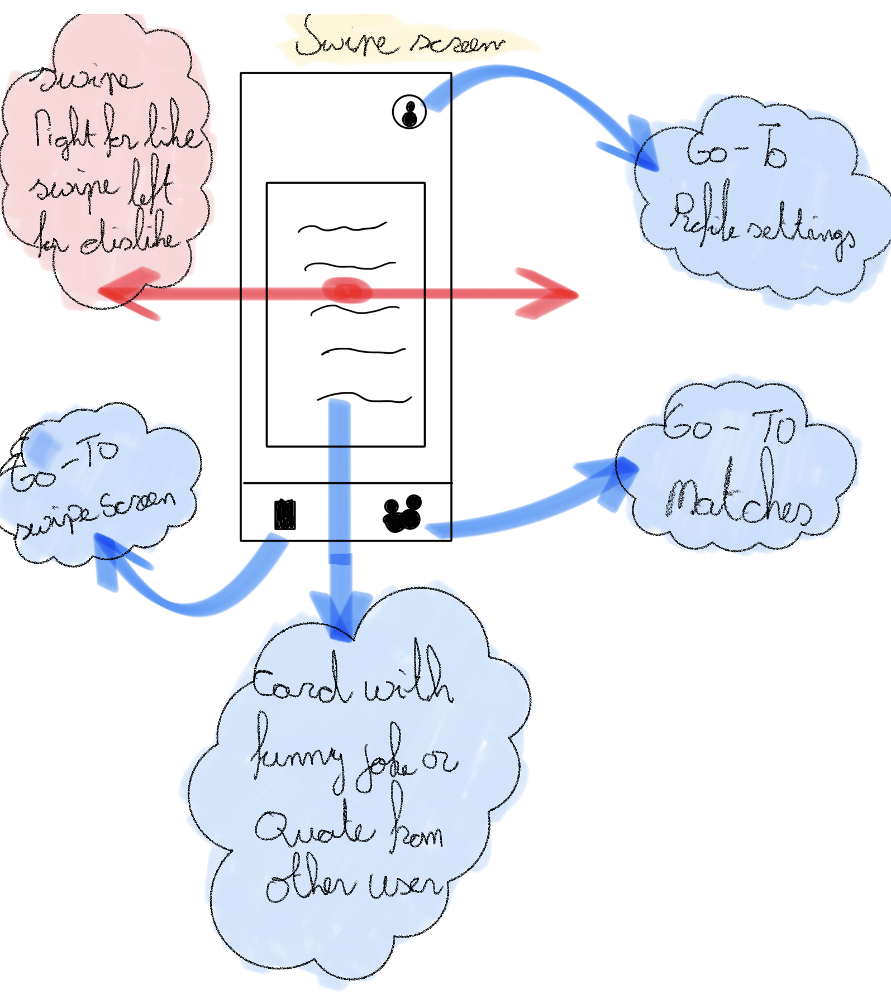
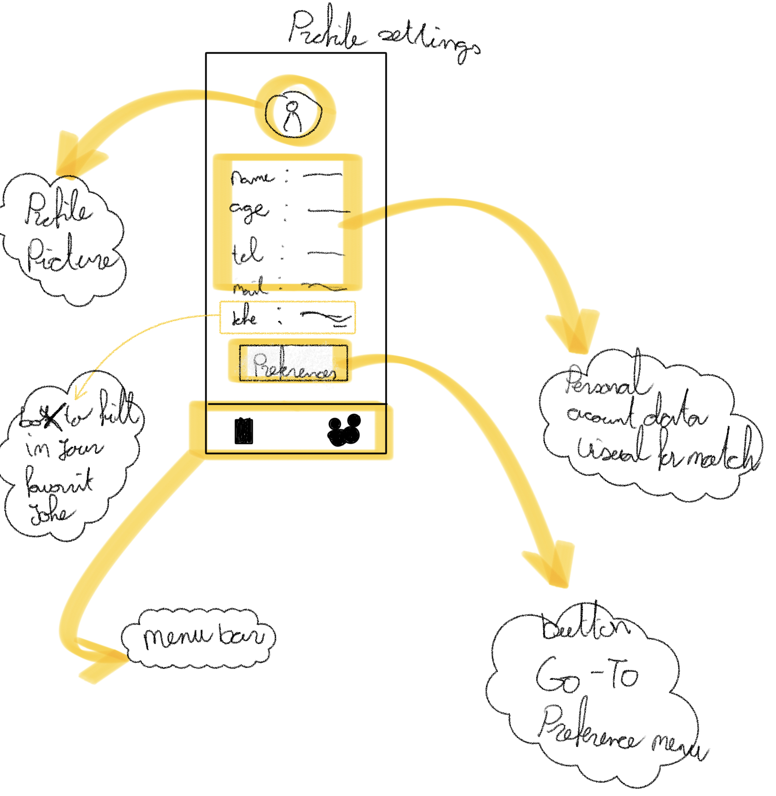
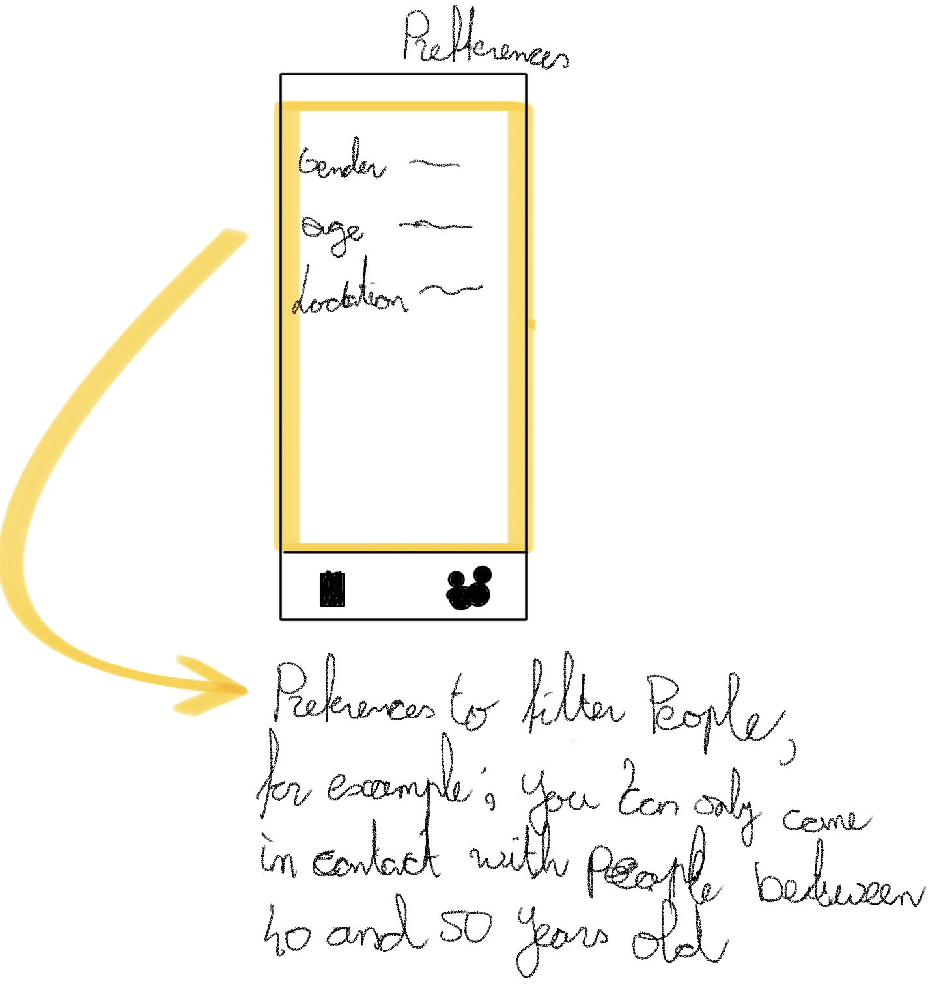
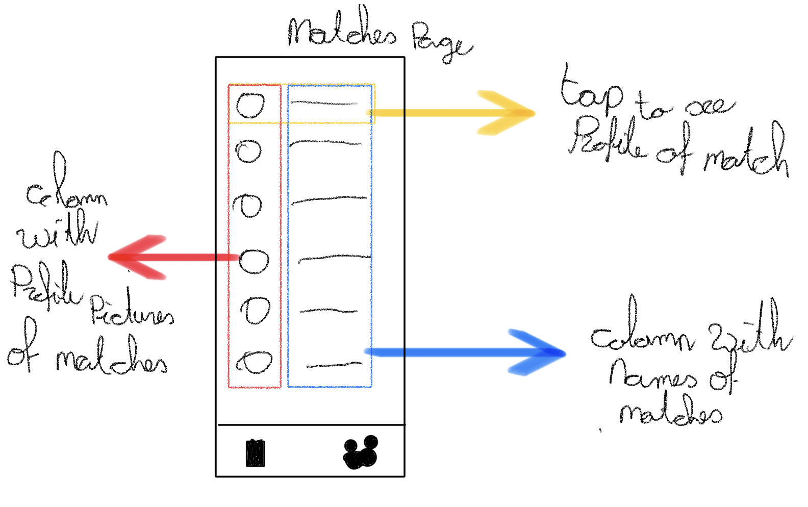
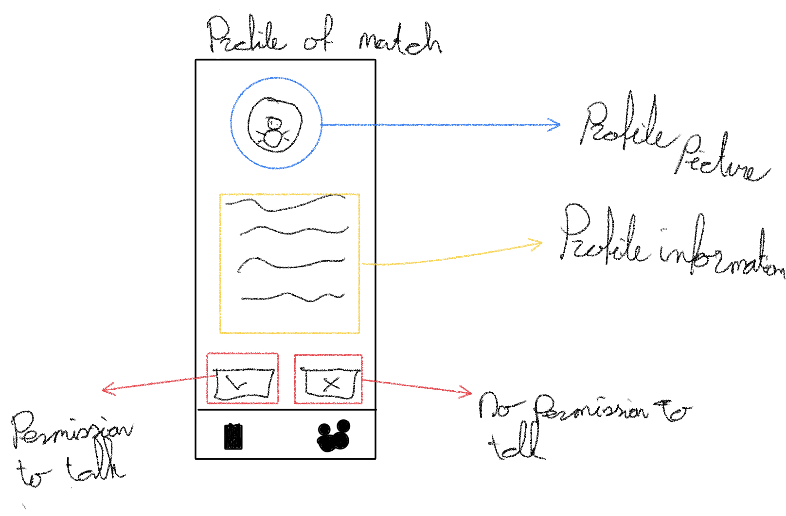

# Humorly

An app that connects people based on their type of humor.

## About me
    Name                    Marc Vlasblom
    Student Number          14078163
    Subject                 Programmeerproject 
    Track                   iOS
    GitHub Account          https://github.com/marcBook-air
    GitHub Repository       https://github.com/minprog-platforms/project-marcBook-air   
## About the app
    Name                    Humorly
    Target audience         All people who want to expand their social circle
    Minimum age             18
    OS                      iOS
    Programming language    Swift & SwiftUI
## The problem
One of the most important things in social relationships is having a common sense of humor. Unfortunately, finding someone with the same kind of humor can turn out to be
quite difficult. The app Humorly helps to solve this problem by creating a platform to build new relationships based on humor. 
## The solution
Humorly matches people based on shared kind of humor. This is how it works:  
When making an account, the users will be asked to give a joke or quote that they think is funny. When using the app it works a lot like the app Tinder: the user gets continuously a quote or joke from another user and can swipe it to the right (if the user finds it funny) or left (if the user finds it unfunny). If two users both like each other's joke, there is a match. In the case of a match users will get each other's contact information.
## Sketches
These are the sketches for the UI of the app:

## Prerequisites
### Data sources
For this project I will use:
- [Swift](https://www.swift.org/documentation/)
- [SwiftUI](https://developer.apple.com/documentation/swiftui/)
- [CloudKit](https://developer.apple.com/documentation/cloudkit) to store user data
### External components
CloudKit is the only external component needed.
### Similar apps
The most similar app is the app Tinder, in which you swipe pictures to the left and right if you find someone attractive or not. The inner workings of Tinder are not public, hence it is not possible to use such information when creating this app.
### Hardest parts
The hardest part of the app is to make the "matching algorims" work. This problem can be solved by efficiently structuring the userdatabase to easily make subsets of the database.
## Acknowledgements

 - [Used README editor](https://readme.so/nl)
 - [Minor programmeren](https://project.mprog.nl/syllabus)
 - I woudl like to thank Finn for helping me come up with the idea for the app

